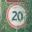
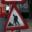

# **Traffic Sign Recognition** 

## Writeup

**Build a Traffic Sign Recognition Project**

The goals / steps of this project are the following:
* Load the data set (see below for links to the project data set)
* Explore, summarize and visualize the data set
* Design, train and test a model architecture
* Use the model to make predictions on new images
* Analyze the softmax probabilities of the new images
* Summarize the results with a written report

The project is not very complicated in terms of explaining the source code
and here is a link to my [project notebook](https://github.com/lexandree/udacity-autonomous-car/blob/master/project3/Traffic_Sign_Classifier.ipynb)

The python notebook is created in the Google Colab and needs only two optional changes to execute:
 1. You need two Telegram parameters for your bot **bot_id** and **chat_id** in the function **to_telegram** where you will receive diagnostics of the training process (optional)
 2. In the Step 3 you can upload your images 32x32x3 for verification (optional)

#### Step 0: Load The Data
Project files are downloaded to a virtual machine and unpacked, pickled data are extracted.

#### Step 1: Dataset Summary & Exploration
I used the numpy library to calculate summary statistics of the traffic
signs data set:

* The size of training set is 34799
* The size of the validation set is 4410
* The size of test set is 12630
* The shape of a traffic sign image is 32x32x3
* The number of unique classes/labels in the data set is 43

Classes are skewed distributed. Number of images is from 180 till 2010 in the train dataset. Exact quantities are shown in three pandas DataFrames. The table with the sign names from **signnames.csv** is followed.

As next you can see three tables with sign images. First, it's a continuous sample of 100 images. The second one is a sample of masked images, and the last one is a table of every class image.

#### Step 2: Design and Test a Model Architecture

 1. As a first step, I decided **not** to convert the images to grayscale because of colorless signs and input formats of pre-trained networks.
 2. The categorical labels are one hot encoded.
 3. The data scaling and augmentation processed due the tensorflow **ImageDataGenerator** class. It looks like the recommendation to scale the data to the [-1 1] range comes from the tanh activation. With the relu activation, I have better results with a range of [0 1]. I have trained NN with the shift range from 0.1 to 0.3 and the middle 0.2 is the best chioce. The samplewise_std_normalization option gives a slight increase in accuracy. Some image classes are slightly rotated and this determines the choice of a large rotation_range value. For large datasets it makes sense to save augmented images to the disk, but when all the data in the memory 'on the fly' works faster.
 
I have used 3 different models:
 1. ResNet50 with different block number
 2. Network with two filter size paths 3x3 and 5x5
 3. LeNet-5 like architecture

All of these networks can have the same accuracy and require hyperparameter tuning. During the setup process, I established the need to exclude a poling layer. At low resolution this layer destroys too much information. Thus LeNet-5 is not suitable in this case, three directly connected convolution layers give the best result. The last ConvNN with a simple configuration was selected for further verification. The complete model layout is at the end of this readme file.  
The following parameters have been selected for training:  
batch_size = 128  
epochs = 75  
Adam optimizer automatically sets the learning rate  
  
As you can see, the validation accuracy goes up to epoch 17, and the EarlyStopping callback ends the trainig at epoch 22. The achieved test accuracy of 95% is equal to the validation accuracy.  

#### Step 3: Test a Model on New Images

I checked the recognition accuracy on 7 images, two of which (number 3 and 6) were not included in the dataset. Logits of an unrecognized image number 5 indicate that further training/processing is necessary.

Predictions  
<table>
<tr>
<td><pre>
1)
14.83  'Children crossing'
11.09  'Speed limit (20km/h)'
9.96  'Speed limit (80km/h)'
6.09  'Bicycles crossing'
4.62  'Speed limit (50km/h)'
</pre></td>
<td><pre>
2)
21.12  'Speed limit (20km/h)'
15.45  'Roundabout mandatory'
12.78  'Speed limit (30km/h)'
3.31  'Speed limit (70km/h)'
2.69  'Speed limit (80km/h)'
</pre></td>
<td><pre>
3)
9.36  'Keep right'
8.25  'Keep left'
5.02  'Priority road'
4.90  'Ahead only'
3.81 'General caution'
</pre></td>
</tr>
<tr>
    <td></td>
    <td></td>
    <td></td>
</tr>
<tr>
<td><pre>
4)
6.48  'Speed limit (30km/h)'
4.41  'Speed limit (80km/h)'
4.19  'Speed limit (20km/h)'
3.08  'Speed limit (50km/h)'
1.99  'Speed limit (100km/h)'
</pre></td>
<td><pre>
5)
14.20 'Right-of-way at the 
       next intersection'
14.08  'Beware of ice/snow'
8.72  'Road work'
1.68  'Pedestrians'
1.40  'Ahead only'
</pre></td>
<td><pre>
6)
5.42  'General caution'
2.13  'Right-of-way at the 
       next intersection'
1.67  'Dangerous curve to the 
       right'
1.56  'Pedestrians'
1.49  'Traffic signals'
</pre></td>
  </tr>
  <tr>
    <td></td>
    <td></td>
    <td></td>
  </tr>
<tr>
<td><pre>
7)
4.72  'Slippery road'
4.66  'Speed limit (80km/h)'
4.15  'Dangerous curve to the right'
4.14  'Speed limit (30km/h)'
2.80  'Speed limit (60km/h)'
</pre></td>
  </tr>
  <tr>
    <td></td>
  </tr>
<tr>
</table>  

One unrecognized image out of five (known classes!) gives an rough estimate of 80% accuracy, but it should be noted that I deliberately selected difficult images.

#### CNN Layout  

