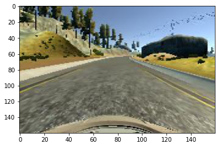
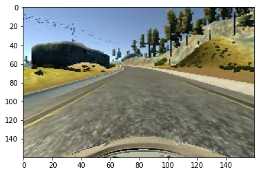
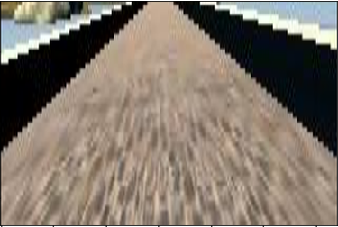
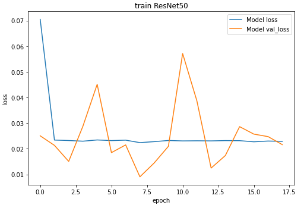
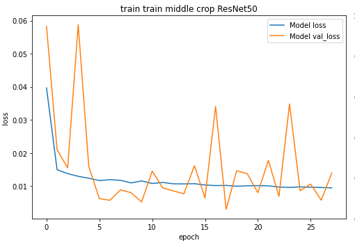
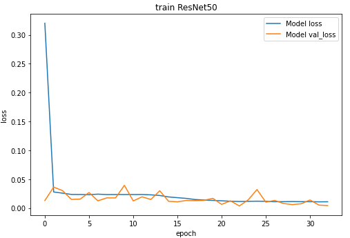
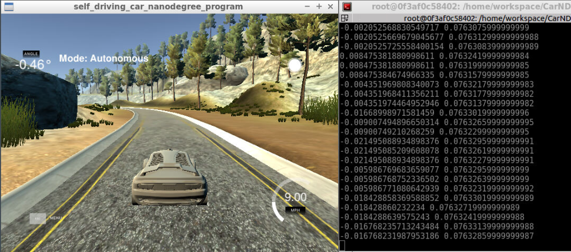
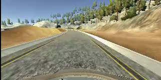

# **Behavioral Cloning** 

**Behavioral Cloning Project**

The goals / steps of this project are the following:
* Use the simulator to collect data of good driving behavior
* Build, a convolution neural network in Keras that predicts steering angles from images
* Train and validate the model with a training and validation set
* Test that the model successfully drives around track one without leaving the road
* Summarize the results with a written report

#### 1. Submission includes all required files and can be used to run the simulator in autonomous mode

My project includes the following files:
* model.py containing the script to create and train the model
* model.png Model Architecture
* drive.py for driving the car in autonomous mode
* model.h5 containing a trained convolution neural network 
* track1.mp4 video recording of vehicle driving autonomously 
* Behavioral_Cloning_v1.ipynb more advanced colab notebook for the latest tensorflow version
* writeup_report.md summarizing the results (this file)

#### 2. Submission includes functional code
Using the Udacity provided simulator and my drive.py file, the car can be driven autonomously around the track by executing 
```sh
python drive.py model.h5
```

#### 3. Submission code is usable and readable

The model.py file contains the code for training and saving the convolution neural network. The file shows the pipeline I used for training and validating the model, and it contains comments to explain how the code works.

### Dataset Description
The dataset consists of 8036 records. Each record is a set of three images 'center', 'left', 'right' and four telemetry values 'steering', 'throttle', 'brake', 'speed'.  
4361 steering angle values are equal to zero, which prevents adequate training of the neural network. I have set these values to 0.001

### Model Architecture and Training Strategy

#### 1. An appropriate model architecture has been employed

My model consists of a convolution neural network ResNet50 with the last resudual block removed. Data preprocessing: lambda layer performs normalization, cropping and resizing, therefore, preprocessing for the inference is not required. The input image size is 160x320x3.  
I tested the LeNet5 model first, but the performance was worse.  
Next I have choice between well known ResNet and relative new EfficientNet.  
The EfficientNetB7 has:  
Total params: 65,478,737  
Trainable params: 65,168,017  
Non-trainable params: 310,720  
and achived val_loss: 0.015, val_mae: 0.068

The ResNet50 is slightly deeper and has:  
Total params: 91,558,537  
Trainable params: 91,505,417  
Non-trainable params: 53,120  
and achived val_loss: 0.011, val_mae: 0.065

The ResNet50 was choosen, see the architecture at the end of file.  

#### 2. Attempts to reduce overfitting in the model
I have used two methods to reduce overfitting: data augmentation as a part of preprocessing and dropout layers as a part of a network architecture.
At first I have tested all augmentation features of the [ImageDataGenerator class](https://keras.io/api/preprocessing/image/#imagedatagenerator-class). But this either did not improve the prediction or worsen the results. Then i found two ways to transform image which improved learning: crop image and flip image horizontally. The image cropping method is implemented as the first [Lambda layer](https://keras.io/api/layers/core_layers/lambda/) of the model. Random image flipping is implemented with OpenCV.

<table>
<tr>
<td><pre>
original
</pre></td>
<td><pre>
flipped
</pre></td>
<td><pre>
cropped
</pre></td>
</tr>
<tr>
    <td></td>
    <td></td>
    <td></td>
</tr>

</table>

The model was trained and validated on different data sets to ensure that the model was not overfitting. The model was tested by running it through the simulator and ensuring that the vehicle could stay on the track.

#### 3. Model training and parameter tuning

The model used an adam optimizer, so the learning rate was not tuned manually.  
One standard deep convolutional network model can be trained in three ways:
- create an instance with pre-trained weights, train only the output full connected layers  
- create an instance with pre-trained weights, train whole model weights  
- create an instance with random weights, needs more training time  
This case with low resolution artificial images shows that the third method is more stable.
<table>
<tr>
<td><pre>
frozen imagenet weights
</pre></td>
<td><pre>
train imagenet weights
</pre></td>
<td><pre>
train random weights
</pre></td>
</tr>
<tr>
    <td></td>
    <td></td>
    <td></td>
</tr>

</table>

#### 4. Advanced models

The more advanced models with multi_output mode tested in colab enviroment. These models need to be improved.  
Further reduction in the number of trained parameters, reduction of blocks is possible. Adding some images from track 2 leads to instability on track 1 but does not improve the first turn of track 2.

#### 5. Model performance
Below is the screenshot of the [Udacity's driving simulator](https://github.com/udacity/self-driving-car-sim) and video that demonstrates the performance of the trained model .  
  
[](https://www.youtube.com/watch?v=GRP7gyGeuls)


**Model Architecture**

