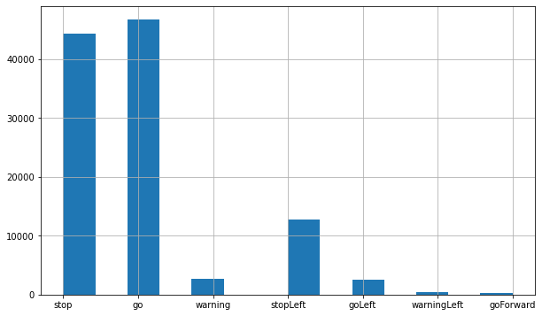
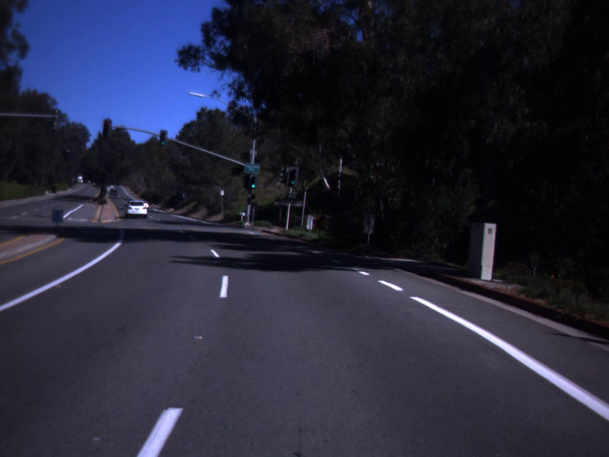
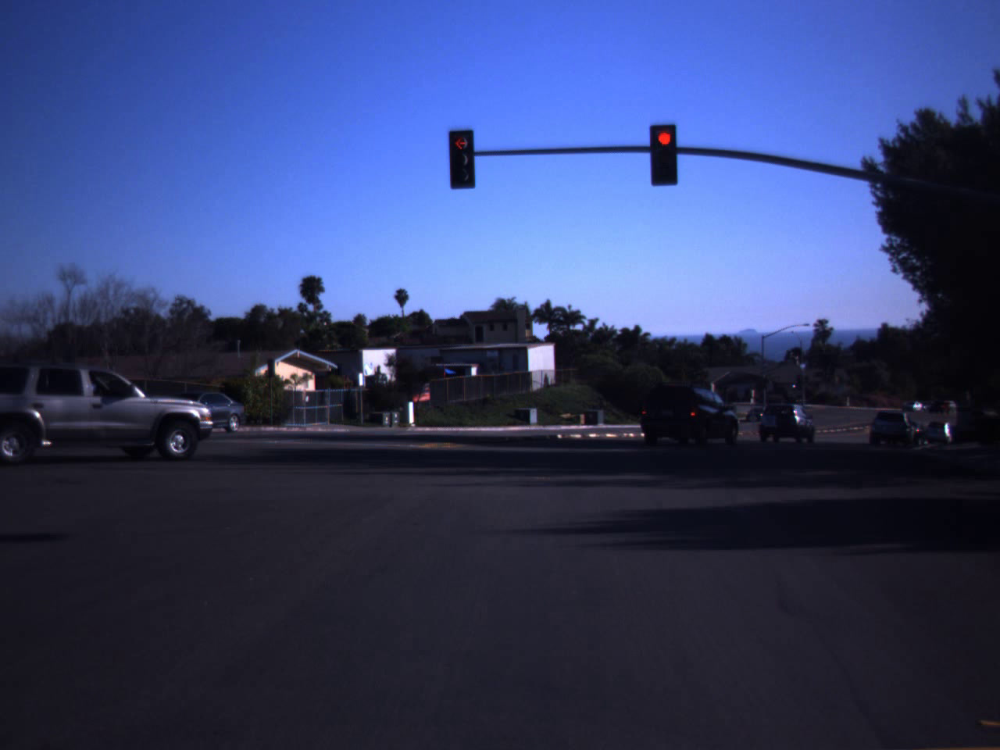
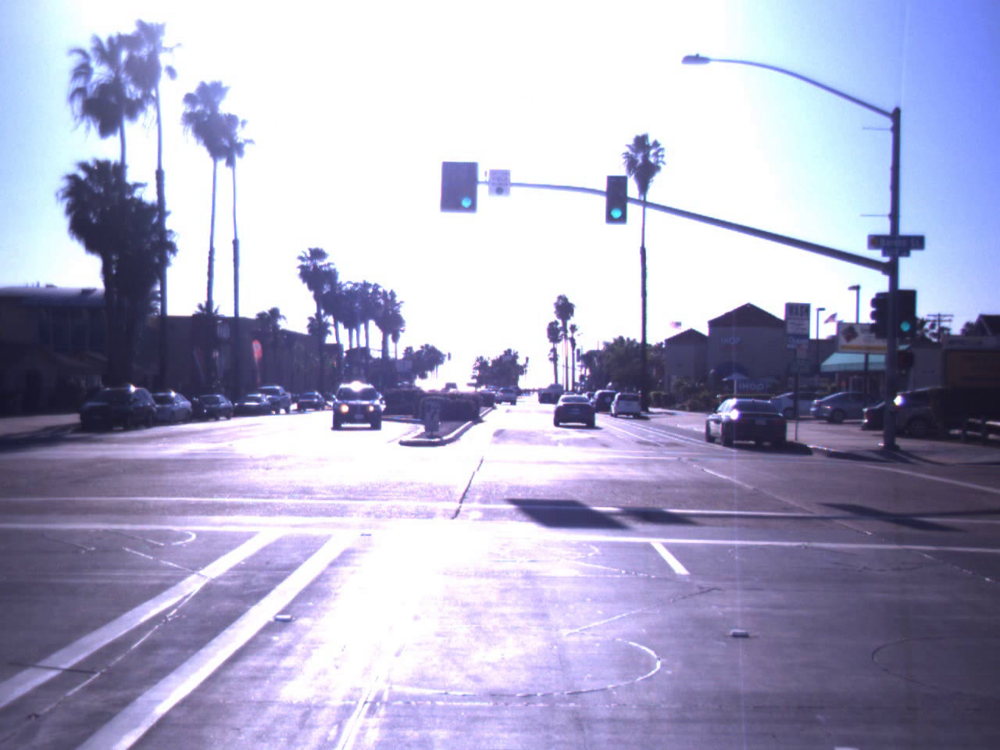
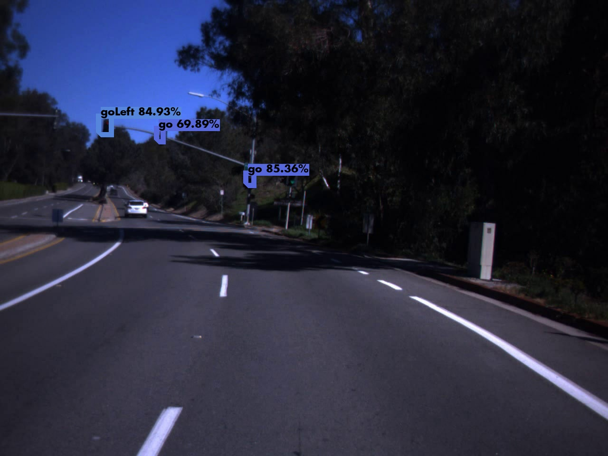
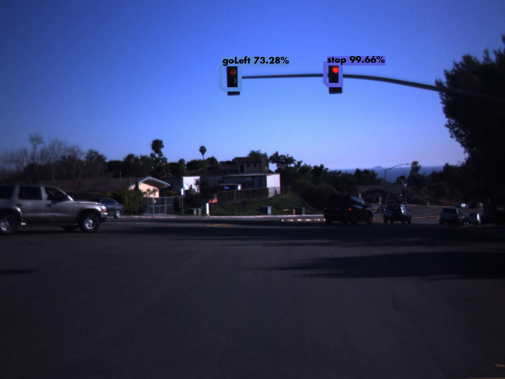
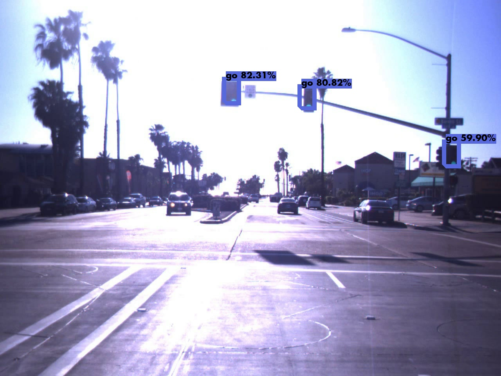

# Project 9 Car ND Capstone
This is the project repo for the final project of the Udacity Self-Driving Car Nanodegree: Programming a Real Self-Driving Car.

## Goal
The goal is to build the software for the entire self-driving car end-to-end both in simulator and on a physical car - the Udacity Carla. The car should drive around the test track using waypoint navigation and stop at a red traffic lights.

## Environment
Prerequisites and instructions how to install project components are on the [project page](https://github.com/udacity/CarND-Capstone) and the websocket is [here](https://github.com/uNetworking/uWebSockets)

I have used Udacity workspace for final run and google colab for YOLO network training.

## System architecture

  
### Implemented ROS nodes:  
### Waypoint updater (Planning)  
This package contains the waypoint updater node: waypoint_updater.py. The purpose of this node is to update the target velocity property of each waypoint based on traffic light and obstacle detection data. This node will subscribe to the /base_waypoints, /current_pose, /obstacle_waypoint, and /traffic_waypoint topics, and publish a list of waypoints ahead of the car with target velocities to the /final_waypoints topic. In the first step, the node only publishes the waypoints from the current position to LOOKAHED_WPS=200.
```python
  closest_idx = self.get_closest_waypoint_idx()
  lane = Lane()
  lane.header = self.base_waypoints.header
  lane.waypoints = self.base_waypoints.waypoints[closest_idx:closest_idx + LOOKAHEAD_WPS]
  self.final_waypoints_pub.publish(lane)
```
The final implementation looks for traffic lights and completes a set of waypoints on the stop line
```python
  if self.stopline_wp_idx == -1 or (self.stopline_wp_idx >= farthest_idx):
      lane.waypoints = base_waypoints
  else:
      lane.waypoints = self.decelerate_waypoints(base_waypoints, closest_idx)
  self.final_waypoints_pub.publish(lane)
```  
### DBW node (Control)  
Carla is equipped with a drive-by-wire (dbw) system, meaning the throttle, brake, and steering have electronic control. This package contains the files that are responsible for control of the vehicle: the node dbw_node.py and the file twist_controller.py, along with a pid and lowpass filter. The controller receives the target linear and angular velocities and publishes the throttle, brake, and steering commands. Also the node defines the publish rate of 10-50 Hz.
```python
  rate = rospy.Rate(self.publish_rate)  # 10Hz
  while not rospy.is_shutdown():
      self.throttle, self.brake, self.steering = self.controller.control(self.current_vel,
                                                                         self.dbw_enabled,
                                                                         self.linear_vel,
                                                                         self.angular_vel)
      if self.dbw_enabled:
          self.publish(self.throttle, self.brake, self.steering)
      rate.sleep()
```
### Traffic Light Detector (Perception)  
This package contains the traffic light detection node: tl_detector.py. This node takes in data from the camera, current position and uses loaded base waypoints and publishes the locations to stop for red traffic lights to the /traffic_waypoint topic. The traffic light classifier controls the execution flow of the traffic light detector, and when red or yellow is detected, the position of the stop line will be published.  
The classifier is implemented as a REST API and can send camera images to any appropriate server that recognizes the objects you need.
```python
  if self.flip_channels:
      image = cv2.cvtColor(image, cv2.COLOR_BGR2RGB)
  is_success, im_buf_arr = cv2.imencode(".jpg", image) # returns array of bytes
  byte_im = im_buf_arr.tobytes()
  files = [('images', ('filename.jpg', byte_im))]
  r = requests.post(self.url, files=files, timeout=5.0)
```
Here is a good reference for OpenCV or PIL images:  
[Convert PIL or OpenCV Image to Bytes without Saving to Disk](https://jdhao.github.io/2019/07/06/python_opencv_pil_image_to_bytes/)  

### Traffic Light Classifier Server  
The server is implemented as a conventional Flask application
```python
  app = Flask(__name__)
  # API that returns JSON with classes found in images
  @app.route('/detections', methods=['POST'])
  def get_detections():
        boxes, scores, classes, nums = yolo(img)
        response.append(<classes etc>)
        return jsonify({"response":response}), 200
  app.run(debug=False, host = '0.0.0.0', port=5000)
```
For the classifier neural network I have choosen YOLOv3 darknet network, tensorflow implementation. The YOLO family is a leader in inference speed, which is especially important in real-time systems, has different implementations in size, has auxiliary data processing procedures during training, is implemented on various backbone libraries, is actively developing.  
One of the best datasets for traffic light detection is the DriveU dataset, but it would be overkill. Comparative analysis shows that the LISA dataset is the best choice.
The dataset consists of 7 classes. They are unevenly distributed, but the two most important classes for this task **stop** and **go** have an appropriate presence.  
  
Predictions  
<table>
<tr>
<td><pre>
inference time: 0.20
go, 0.85, [0.41 0.39 0.42 0.41]
goLeft, 0.85, [0.17 0.26 0.19 0.30]
go, 0.70, [0.26 0.20 0.27 0.32]  
</pre></td>
 <td><pre>
inference time: 0.21
stop, 0.99, [0.65 0.17 0.68 0.23]
goLeft, 0.73, [0.44 0.17 0.48 0.24]  
</pre></td>
 <td><pre>
inference time: 0.20
go, 0.82, [0.45 0.21471669 0.48 0.28]
go, 0.81, [0.60 0.23517041 0.63 0.29]
go, 0.60, [0.89 0.38 0.92 0.45]  
</pre></td>
  </tr>
  <tr>
    <td></td>
    <td></td>
    <td></td>
  </tr>
  <tr>
    <td></td>
    <td></td>
    <td></td>
  </tr>
 </table>
 

## Build Instructions for the Udacity Project Workspace  

1. Run the Capstone Project Workspace with GPU
2. Click "Go To Desktop" and open Terminator in VNC session
3. ```cd /home/workspace/Object-Detection-API```  
  ```/root/miniconda3/condabin/conda update -n base -c defaults conda```  
  ```/root/miniconda3/condabin/conda env create --file conda-gpu.yml```  
  ```/root/miniconda3/condabin/conda init bash```  
4. Close and re-open Terminator
5. ```cd /home/workspace/Object-Detection-API```  
  ```python app.py```  
  wait for string: * Running on http://0.0.0.0:500/
6. Install and run the project from the workspace terminal as usually 
  (for new Terminator session you need to exit **base** environment first: **conda deactivate**)  
  ```cd /home/workspace/CarND-Capstone```  
  ```pip install -r requirements.txt```  
  ```cd ros```  
  ```catkin_make```  
  ```source devel/setup.sh```  
  ```roslaunch launch/styx.launch```  
7.  Run the “Capstone Simulator” 


